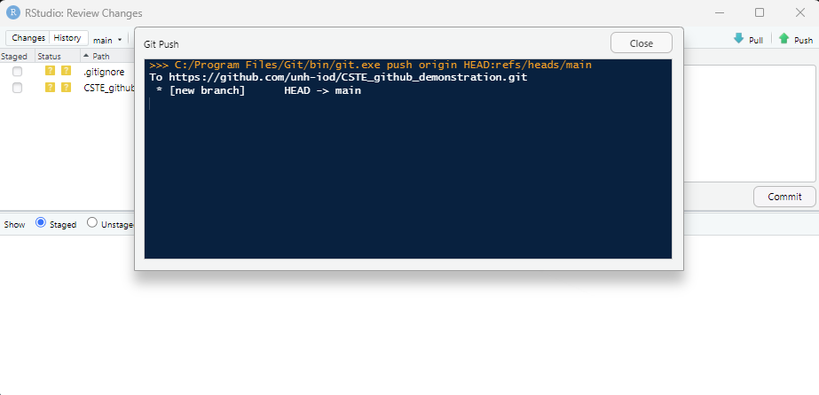

```{r setup = TRUE, echo=FALSE, warning=FALSE, error=FALSE, include=FALSE}
library(SASmarkdown)
library(dplyr)
library(flextable)
```

## Purpose

Demonstrate:

1. the benefits of utilizing github as a file retention, collaboration, and version control toolset.

2. a quick How-To, to set up github and utilize it within RStudio.

Disclaimer:  This is only intended for familiarization purposes - github's functionality and use far exceeds what I'll be able to go over here.  I'm not affilidated with Github in any way.

## Why Use Github?

**Have you ever updated a file, and regretted it - wishing you could revert back to a previous version?** - I mash Ctrl+S continuously during file/document updates as a matter of course... but sometimes I wish I hadn't.

**Are your analysis files stored in a *less than easy to use and unintuitive*  C:/users/[username]/Documents folder, like a filing cabinet without folders?** Sometimes if one is just "doing this one thing quickly" and lax about keeping files rigorously organized you can really put yourself in a bind - if you have to then update it. 

**Do you have to pick up analysis from projects months, even years later - and have a hard time remembering where you were at in the process?**  Long term memory should be reserved for your important moments in life... project status shouldn't have to be something you need to keep track of...

## What does Github actually do? [www.github.com]

Github provides a **free** (with limitations) version control and collaboration system.  

Repository (Repo) - a github project container.

Fetch - retrieve new work by others using the repo.

Merge - combine fetched work with your local work.

Pull - Fetch and Merge combined (run at the same time).

Push - Send local work to the repo.

Clone - clones a repo to your local computer. 

Every github repo has a unique URL - this exact project is here: https://github.com/unh-iod/CSTE_github_demonstration 


## A quick aside - SAS can be run in RStudio

My personal preference is to use Github within the RStudio integrated development environment (IDE).  This isn't just for people using R as their prefered scripting language.

```{r}
#library(SASmarkdown)
```

Example dataset (class) from SAS from the sashelp library

```{sas}
proc means data=sashelp.class;
output out=temp;
run;

proc export data=temp
outfile="sas_data.csv"
dbms=csv
replace;
run;
```

## Passing data from SAS into R:

```{r}
read.csv("sas_data.csv") %>% data.frame() %>% flextable()
```

## Where to start...?

Source: https://resources.github.com/github-and-rstudio/

1. Download and install [Git](https://help.github.com/articles/set-up-git/)

2. Download and install [RStudio](https://www.rstudio.com/products/rstudio/download/). (1.1.383 or higher).

3. Create a remote repository on Github: 

 

4. Copy the unique URL from github Code tab:


5. Open RStudio and connect to your github account using the following commands:

```{r eval=FALSE}
#if not already installed, install the package
install.packages("usethis")
#load the package
library(usethis)
# configure your git account in RStudi:
usethis::use_git_config(user.name = "YourName", user.email = "your@mail.com")
# create a personal access token (PAT) for git authentication:
usethis::create_github_token() 
# set the personal access token (PAT)
credentials::set_github_pat("YourPAT")
# or store it manually in '.Renviron' - parameter file for defining environment parameters when opening RStudio
usethis::edit_r_environ()
#--------------------------
###########################
# then restart RStudio !
###########################
#--------------------------
```

6. In RStudio create a new project `r "New Project > Version Control > Git"``:

 >  > 

7. Paste the unique github repo URL and select a directory in which to create the R project:


8. This will create the folder and copy all contents of the github repo into the new local directory. This is a new repo and so only contains a .gitignore file (more on this later):


## Adding files to the repo:

1. Select `r "Git > Commit"`:


2. Stage the new file for Commit - a "Commit message" is required:


3. The new repo branch "Main" is created:



## Updating the file

This how you update files already in the repo:

1. Save the file locally.

2. Commit the changes:


3. Push the changes to the remote github repo:


## Reviewing changes to the project on github:

1. Navigate to the github repo url: [Example](https://github.com/unh-iod/CSTE_github_demonstration)


2. Select a file to review  and select :


3. Select a Commit to review exactly what changed:


## Inviting others to collaborate:

1. Setting tab in the github repo select Collaborators:


2. Adding github users is as easy as adding them here.

3. An email invitation will be sent to the prospective collaborator - and they will be able to then accept the invitation and work on the repo.

## Ignoring files in the local directory

1. Select `r "Git > Commit"` and click  

2. Enter file names for files that should only be stored locally (ignored by the repo)


3. Select Save - this updates the .gitignore file

## Please clone this repo...

https://github.com/unh-iod/CSTE_github_demonstration 

If you clone this repo, file which generates the entire presentation is "demonstration.Rmd"

Install any libraries required by RStudio.

Click Knit... 


## Questions? 


## Resources

https://resources.github.com/github-and-rstudio/

Install RStudio: https://posit.co/download/rstudio-desktop/ 

Github quickstart: https://docs.github.com/en/get-started/quickstart/hello-world
